# Tweeter Application Component Interaction Diagram

## Overview
This diagram illustrates how the components in the Tweeter application interact with each other, including data flow through React Context providers and the routing structure.

## Component Interaction Diagram

```mermaid
graph TB
    %% Root Level
    Root[index.tsx] --> UIP[UserInfoProvider]
    UIP --> TIP[ToastInfoProvider]
    TIP --> App[App.tsx]

    %% App Level Routing
    App --> |"isAuthenticated() ? true"| AR[AuthenticatedRoutes]
    App --> |"isAuthenticated() ? false"| UR[UnauthenticatedRoutes]
    App --> Toaster[Toaster]

    %% Unauthenticated Routes
    UR --> Login[Login]
    UR --> Register[Register]
    Login --> AFL1[AuthenticationFormLayout]
    Register --> AFL2[AuthenticationFormLayout]

    %% Authenticated Routes
    AR --> ML[MainLayout]
    ML --> AppNavbar[AppNavbar]
    ML --> UserInfo[UserInfoComponent]
    ML --> PostStatus[PostStatus]
    ML --> |"<Outlet />"| Scrollers

    %% Scroller Components
    Scrollers --> FS[FeedScroller]
    Scrollers --> SS[StoryScroller]
    Scrollers --> FES[FolloweesScroller]
    Scrollers --> FRS[FollowersScroller]

    %% Status Item Components
    FS --> Post1[Post]
    SS --> Post2[Post]
    FES --> UserItem1[UserItem]
    FRS --> UserItem2[UserItem]

    %% Context Usage (Data Flow)
    subgraph "Context Providers"
        UIC[UserInfoContext]
        UIAC[UserInfoActionsContext]
        TLC[ToastListContext]
        TAC[ToastActionsContext]
    end

    %% Context Consumers
    App -.->|"useContext"| UIC
    AppNavbar -.->|"useContext"| UIC
    AppNavbar -.->|"useContext"| UIAC
    AppNavbar -.->|"useContext"| TAC

    UserInfo -.->|"useContext"| UIC
    UserInfo -.->|"useContext"| UIAC
    UserInfo -.->|"useContext"| TAC

    PostStatus -.->|"useContext"| UIC
    PostStatus -.->|"useContext"| TAC

    FS -.->|"useContext"| UIC
    FS -.->|"useContext"| UIAC
    FS -.->|"useContext"| TAC

    SS -.->|"useContext"| UIC
    SS -.->|"useContext"| UIAC
    SS -.->|"useContext"| TAC

    FES -.->|"useContext"| UIC
    FES -.->|"useContext"| UIAC
    FES -.->|"useContext"| TAC

    FRS -.->|"useContext"| UIC
    FRS -.->|"useContext"| UIAC
    FRS -.->|"useContext"| TAC

    Login -.->|"useContext"| UIAC
    Login -.->|"useContext"| TAC

    Register -.->|"useContext"| UIAC
    Register -.->|"useContext"| TAC

    Post1 -.->|"useContext"| UIC
    Post1 -.->|"useContext"| UIAC
    Post1 -.->|"useContext"| TAC

    Post2 -.->|"useContext"| UIC
    Post2 -.->|"useContext"| UIAC
    Post2 -.->|"useContext"| TAC

    Toaster -.->|"useContext"| TLC
    Toaster -.->|"useContext"| TAC

    %% Styling
    classDef provider fill:#e1f5fe
    classDef context fill:#f3e5f5
    classDef route fill:#e8f5e8
    classDef component fill:#fff3e0
    classDef scroller fill:#fce4ec

    class UIP,TIP provider
    class UIC,UIAC,TLC,TAC context
    class AR,UR,ML route
    class App,AppNavbar,UserInfo,PostStatus,Login,Register,AFL1,AFL2,Toaster component
    class FS,SS,FES,FRS,Post1,Post2,UserItem1,UserItem2 scroller
```

## Key Component Interactions

### 1. Provider Hierarchy
- `UserInfoProvider` wraps `ToastInfoProvider` which wraps `App`
- Provides global state for user authentication and toast notifications

### 2. Routing Structure
- `App` conditionally renders `AuthenticatedRoutes` or `UnauthenticatedRoutes`
- `MainLayout` serves as the shell for authenticated pages with `<Outlet />` for dynamic content

### 3. Context Dependencies
- **UserInfoContext**: Current user, displayed user, auth token
- **UserInfoActionsContext**: Functions to update user state
- **ToastActionsContext**: Functions to display/manage notifications
- **ToastListContext**: Current toast notifications

### 4. Data Flow
- Authentication flows from Login/Register → UserInfoProvider → App routing decision
- User navigation updates displayedUser context, triggering re-renders in dependent components
- Toast messages flow from any component → ToastInfoProvider → Toaster display

### 5. Scroller Components
- All scrollers (`FeedScroller`, `StoryScroller`, `FolloweesScroller`, `FollowersScroller`) follow similar patterns
- Use infinite scroll with pagination
- Consume user/toast contexts for state and error handling
- Render child components (`Post`, `UserItem`) with context data

## Component Descriptions

### Core Components

| Component | Purpose | Key Dependencies |
|-----------|---------|------------------|
| `App` | Main routing logic and authentication check | UserInfoContext |
| `MainLayout` | Layout shell for authenticated pages | N/A |
| `AppNavbar` | Navigation bar with logout functionality | UserInfoContext, UserInfoActionsContext, ToastActionsContext |
| `UserInfoComponent` | Displays user profile and follow/unfollow actions | UserInfoContext, UserInfoActionsContext, ToastActionsContext |
| `PostStatus` | Form for creating new posts | UserInfoContext, ToastActionsContext |

### Authentication Components

| Component | Purpose | Key Dependencies |
|-----------|---------|------------------|
| `Login` | User login form | UserInfoActionsContext, ToastActionsContext |
| `Register` | User registration form | UserInfoActionsContext, ToastActionsContext |
| `AuthenticationFormLayout` | Shared layout for auth forms | N/A |

### Data Display Components

| Component | Purpose | Key Dependencies |
|-----------|---------|------------------|
| `FeedScroller` | Displays feed posts with infinite scroll | UserInfoContext, UserInfoActionsContext, ToastActionsContext |
| `StoryScroller` | Displays user's story posts | UserInfoContext, UserInfoActionsContext, ToastActionsContext |
| `FolloweesScroller` | Displays list of users being followed | UserInfoContext, UserInfoActionsContext, ToastActionsContext |
| `FollowersScroller` | Displays list of followers | UserInfoContext, UserInfoActionsContext, ToastActionsContext |
| `Post` | Individual post display with clickable links | UserInfoContext, UserInfoActionsContext, ToastActionsContext |
| `UserItem` | Individual user display in lists | UserInfoContext, UserInfoActionsContext, ToastActionsContext |

### Utility Components

| Component | Purpose | Key Dependencies |
|-----------|---------|------------------|
| `Toaster` | Displays toast notifications | ToastListContext, ToastActionsContext |
| `UserInfoProvider` | Provides user state management | N/A |
| `ToastInfoProvider` | Provides toast notification management | N/A |

## Architecture Notes

The application follows a clean architecture with:
- **Context API** for global state management
- **React Router** for client-side routing
- **Component composition** with clear separation of concerns
- **Infinite scroll pattern** for data loading
- **Consistent error handling** through toast notifications
- **Responsive design** using Bootstrap CSS framework

All data fetching currently uses `FakeData.instance` for mock data, with TODO comments indicating where server calls should be implemented.